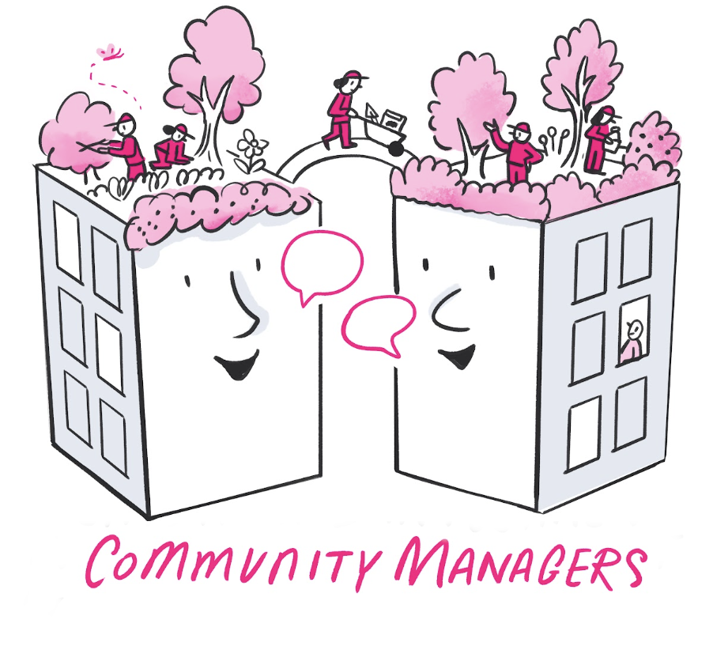

## Welcome to the Research Community Managers Wiki

The [Tools, Practices and Systems (TPS)](https://www.turing.ac.uk/research/research-programmes/tools-practices-and-systems) programme at The Alan Turing Institute, under the leadership of Dr Kirstie Whitaker, represents a cross-cutting set of initiatives which seek to build open source infrastructure that is accessible to all and to empower a global, decentralised network of people who connect data with domain experts.

Led by Dr Malvika Sharan, TPS Senior Researcher for Open Research, TPS hosts the [Open Research Community Management](https://www.turing.ac.uk/research/research-programmes/tools-practices-and-systems/community-management-and-open-research) team with all Research Community Managers (RCMs) working across multiple teams, projects and programmes at the Institute.

All members of this team also participate in [*The Turing Way*](https://the-turing-way.netlify.app/welcome) -- an Open Source, Open Collaboration and Community-driven guide to data science, co-led by Kirstie (who is also the founder of the project) and Malvika.
Part of the Research Community Managers' role is to engage with and contribute to *The Turing Way* as TPS staff members of the project.

Members from within the Turing programmes working in similar positions, as well as members from projects collaborating with TPS/*The Turing Way* outside the Turing, referred to as "collaborators in community roles" in this document, are invited to join this team based on formal project or team-based collaboration.

Anyone interested in the work of this team from outside the Turing or non-collaborators is invited to collaborate with us on *The Turing Way*.
For further questions and information, please get in touch with Malvika by emailing [msharan@turing.ac.uk](mailto:msharan@turing.ac.uk).

## About this wiki

These pages are the central RCM knowledge management resource. They include links to training and onboarding resources, best practices and frameworks, the communities we support and RCM team projects we lead.

<!-- link out to each of the above in a 'resources' page -->

## Contributing

We welcome suggestions and contributions, especially drawing from the projects the RCM team participate in. All resources for this wiki are stored in our [GitHub repository](https://github.com/alan-turing-institute/open-research-community-management).
We encourage anyone reading this repository to report mistakes and errors, propose changes in our existing resources or share constructive feedback as a GitHub issue.
Read our [contribution guideline](https://github.com/alan-turing-institute/open-research-community-management/blob/main/CONTRIBUTING.md) for details.

We have a [Code of Conduct](https://github.com/alan-turing-institute/open-research-community-management/blob/main/CODE_OF_CONDUCT.md) that applies to all the activities and projects involved in the development and maintenance of this repository and related resources.

<!-- Members of the Open Research Community Building team will ensure that research and data-driven AI solutions at the Turing use and build on open source tools, practices and systems by empowering people in the research community with open research skills. Building on the successes of the Tools, Practices and Systems research programme, Community Managers advance and scale the bidirectional flow of knowledge, resources and evidence for high-quality research within the Institute, as well as connect them across national and international data science communities. The aim is to empower Communities of Practice (CoP) at the Turing and more widely by granting them access to the skills and support they need to participate, collaborate and build something that is bigger than the sum of its parts. -->

